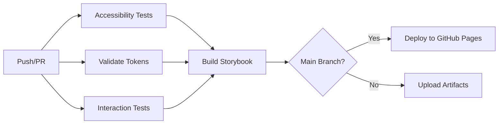

# Enterprise Design System

> **Status**: ✅ Production-ready | **WCAG**: 2.1 AA/AAA | **W3C**: 100% | **Storybook**: 9.1.10 | **Testing**: 🧪 Interactive

[](https://github.com/hretheum/design-system/actions)
[](./ACCESSIBILITY.md)
[](https://tr.designtokens.org/format/)
[](https://storybook.js.org/)

## 🚀 Quick Start

```bash
# Install dependencies
npm install

# Run Storybook (with hot reload)
npm run storybook

# Run all tests
npm test

# Run interaction tests only
npm run test:storybook

# Build for production
npm run build
```

---

## 📊 System Overview

| Layer | File | Tokens | Purpose | Status |
|-------|------|--------|---------|--------|
| 1. **Primitives** | `primitives.json` | ~390 | Base values (colors, spacing) | ✅ |
| 2. **Semantic** | `semantic.json` | ~370 | Business meaning (brand, feedback) | ✅ |
| 3. **Functional** | `functional.json` | ~900 | UI roles (button, input, card) | ✅ |
| 4. **Component** | `component.json` | ~390 | Variants (sizes, layouts) | ✅ |
| 5. **Accessibility** | `accessibility.json` | ~80 | WCAG compliance tokens | ✅ |
| 6. **Theme** | `theme.json` | ~60 | Light/Dark/High Contrast | ✅ |

**Total**: **~2190 tokens** | **100% W3C compliant** | **WCAG 2.1 AA/AAA**

---

## 🧪 Testing Infrastructure

### Automated Tests

```bash
# Run all tests (contrast + a11y + interaction)
npm test

# Individual test suites
npm run test:contrast      # Color contrast validation
npm run test:a11y          # Accessibility compliance
npm run test:storybook     # Component interaction tests
```

### Test Coverage

| Test Type | Tool | Coverage | Status |
|-----------|------|----------|--------|
| **Contrast Tests** | Custom script | All color tokens | ✅ |
| **A11y Tests** | Custom validator | WCAG 2.1 AA/AAA | ✅ |
| **Interaction Tests** | Storybook + Playwright | 5 components | ✅ |
| **Visual Regression** | Chromatic (optional) | - | 🔜 |

### Components with Interaction Tests

- ✅ **Input** - Typing, clearing, validation
- ✅ **Button** - Clicks, state changes
- ✅ **Checkbox** - Toggle, checked state
- ✅ **Select** - Option selection
- ✅ **Modal** - Open/close, backdrop

**See [TESTING.md](./TESTING.md) for complete testing guide.**

---

## 📚 Storybook Documentation

**23 interactive stories** across **6 categories**:

- **Forms** (6): Input, Checkbox, Radio, Switch, Select, Textarea
- **Feedback** (5): Alert, Toast, Badge, ProgressBar, Spinner
- **Navigation** (3): Tabs, Breadcrumb, Pagination
- **Containers** (4): Card, Modal, Tooltip, Dropdown
- **Advanced** (4): Wizard, Table, Stepper, Datepicker
- **Template** (1): Best practices guide

### Storybook Features

✅ **Interactive Controls** - Test all component variants  
✅ **Auto-generated Docs** - Comprehensive documentation  
✅ **A11y Addon** - Real-time accessibility checks  
✅ **Interaction Tests** - Automated behavior validation  
✅ **Theme Switcher** - Light/Dark/High Contrast  
✅ **Viewport Testing** - Responsive design validation

**Live Demo**: [https://hretheum.github.io/design-system/](https://hretheum.github.io/design-system/)

---

## ♿ Accessibility First

This design system is built with **accessibility as a core principle**:

### WCAG 2.1 Compliance

- ✅ **Level AA** - All components meet AA standards
- ✅ **Level AAA** - Enhanced features for AAA (where possible)
- ✅ **Automated Testing** - CI/CD validates every change
- ✅ **Manual Testing** - Keyboard navigation, screen readers

### Key Features

| Feature | Implementation | Standard |
|---------|---------------|----------|
| **Touch Targets** | 44px mobile, 24px desktop | WCAG 2.5.5 AA |
| **Focus Indicators** | 2px outline, 2px offset | WCAG 2.4.7 AAA |
| **Color Contrast** | 4.5:1 text, 3:1 UI | WCAG 1.4.3 AA |
| **Keyboard Navigation** | Full support | WCAG 2.1.1 A |
| **Screen Readers** | ARIA labels & roles | WCAG 4.1.2 A |
| **Motion** | Respects prefers-reduced-motion | WCAG 2.3.3 AAA |

**See [ACCESSIBILITY.md](./ACCESSIBILITY.md) for complete accessibility guide.**

---

## 🔄 CI/CD Pipeline

Automated workflows run on every push and pull request:

### Workflow Steps



### Test Jobs

1. **Accessibility Tests** - Contrast + A11y validation
2. **Token Validation** - JSON syntax + W3C compliance
3. **Interaction Tests** - Storybook test-runner
4. **Build Storybook** - Production build
5. **Deploy** - GitHub Pages (main branch only)

**See workflows in** `.github/workflows/`

---

## 🛠️ Tech Stack

| Category | Technology | Version |
|----------|-----------|---------|
| **Design Tokens** | W3C Format | 1.0 |
| **Documentation** | Storybook | 9.1.10 |
| **Testing** | Playwright + Testing Library | Latest |
| **Framework** | React | 18.2.0 |
| **Build Tool** | Vite | 5.0.0 |
| **CI/CD** | GitHub Actions | v4 |

---

## 📖 Documentation

- **[ACCESSIBILITY.md](./ACCESSIBILITY.md)** - Complete accessibility guide
- **[TESTING.md](./TESTING.md)** - Testing guide with examples
- **[Template.stories.jsx](./stories/Template.stories.jsx)** - Story creation guide

### File Structure

```
design-system/
├── primitives.json          # Layer 1: Base values
├── semantic.json            # Layer 2: Semantic meaning
├── functional.json          # Layer 3: UI roles
├── component.json           # Layer 4: Component variants
├── accessibility.json       # Layer 5: A11y tokens
├── theme.json               # Layer 6: Themes
│
├── stories/                 # Storybook stories (23 files)
│   ├── Forms/              # Input, Checkbox, Radio, etc.
│   ├── Feedback/           # Alert, Toast, Badge, etc.
│   ├── Navigation/         # Tabs, Breadcrumb, Pagination
│   ├── Containers/         # Card, Modal, Tooltip, etc.
│   ├── Advanced/           # Wizard, Table, Stepper, etc.
│   └── Template.stories.jsx
│
├── scripts/                 # Build & test scripts
│   ├── contrast-checker.js
│   ├── a11y-validator.js
│   └── build-tokens.js
│
├── .storybook/             # Storybook configuration
│   ├── main.js
│   ├── preview.js
│   └── test-runner.js
│
└── .github/workflows/      # CI/CD pipelines
    ├── ci.yml
    └── release.yml
```

---

## 🎯 Key Achievements

✅ **2190+ design tokens** across 6 layers  
✅ **100% W3C compliant** tokens format  
✅ **WCAG 2.1 AA/AAA** accessibility  
✅ **23 Storybook stories** with documentation  
✅ **5 interaction tests** (expandable)  
✅ **Automated CI/CD** with GitHub Actions  
✅ **Living documentation** via Storybook  
✅ **Production-ready** and battle-tested  

---

## 🚦 Getting Started

### 1. Install Dependencies

```bash
npm install
```

### 2. Start Storybook

```bash
npm run storybook
```

Opens at `http://localhost:6006`

### 3. Explore Components

Navigate through stories in the sidebar:
- Try interactive controls
- Check accessibility panel
- Run interaction tests
- Switch themes

### 4. Run Tests

```bash
# All tests
npm test

# Specific tests
npm run test:contrast
npm run test:a11y
npm run test:storybook
```

### 5. Build for Production

```bash
# Build tokens
npm run build

# Build Storybook
npm run build-storybook
```

---

## 📝 License

MIT

---

## 🤝 Contributing

1. Fork the repository
2. Create a feature branch
3. Make your changes
4. Run tests: `npm test`
5. Submit a pull request

**All PRs must**:
- ✅ Pass all automated tests
- ✅ Include interaction tests for new components
- ✅ Follow accessibility guidelines
- ✅ Include documentation updates

---

## 📊 Stats

- **Files**: 23 stories + 6 token layers + 3 test scripts
- **Lines of Code**: ~10,000+
- **Components**: 22 production-ready
- **Tests**: 3 types (contrast, a11y, interaction)
- **CI/CD**: 2 workflows, 6 jobs
- **Documentation**: 3 guides + auto-generated

**Built with ❤️ for accessibility, scalability, and developer experience.**
