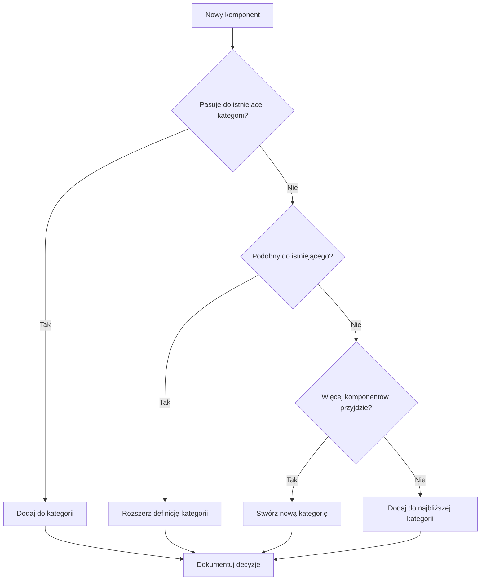

# 📘 Manual kategoryzacji funkcjonalnej komponentów Design System
*Wersja 1.0 | Październik 2025*

## Spis treści
1. [Wprowadzenie](#wprowadzenie)
2. [Proces kategoryzacji krok po kroku](#proces-kategoryzacji-krok-po-kroku)
3. [Definicje kategorii głównych](#definicje-kategorii-głównych)
4. [Matryca decyzyjna](#matryca-decyzyjna)
5. [Przypadki skrajne i konfliktowe](#przypadki-skrajne-i-konfliktowe)
6. [Walidacja kategoryzacji](#walidacja-kategoryzacji)
7. [Utrzymanie i ewolucja](#utrzymanie-i-ewolucja)
8. [Checklisty i narzędzia](#checklisty-i-narzędzia)

---

## Wprowadzenie

### Cel dokumentu
Manual umożliwia konsekwentną kategoryzację komponentów w dowolnym design systemie, niezależnie od jego wielkości czy branży. Bazuje na analizie 13 wiodących systemów, z PatternFly (96 komponentów) jako wzorcem kompleksowości.

### Dla kogo jest ten manual?
- **Junior Designers/Developers** - jasne kroki i checklisty
- **Senior Team Members** - matryca decyzyjna, edge cases
- **Design System Teams** - proces governance i ewolucji
- **Product Managers** - metryki sukcesu i ROI

### Zasady nadrzędne
1. **User-first**: Kategorie odzwierciedlają mentalne modele użytkowników
2. **Task-oriented**: Grupowanie według zadań, nie struktury
3. **Findability > Purity**: Łatwość znalezienia > perfekcyjna taksonomia
4. **Single source of truth**: Jeden komponent, jedna lokalizacja
5. **Progressive disclosure**: Od najprostszych do najbardziej złożonych

---

## Proces kategoryzacji krok po kroku

### Faza 1: Inwentaryzacja (Dzień 1-3)

#### Krok 1.1: Zbierz wszystkie komponenty
```markdown
☐ Lista wszystkich istniejących komponentów
☐ Warianty i stany każdego komponentu
☐ Zależności między komponentami
☐ Częstotliwość użycia (z analytics)
☐ Feedback użytkowników
```

#### Krok 1.2: Utworz kartę komponentu
Dla każdego komponentu wypełnij:
```yaml
Component: [Nazwa]
Primary_Function: [Co robi]
User_Intent: [Czego szuka użytkownik]
Common_Tasks: [Lista zadań]
Related_Components: [Powiązane]
Current_Category: [Jeśli istnieje]
Usage_Frequency: [High/Medium/Low]
Complexity: [Simple/Moderate/Complex]
```

### Faza 2: Kategoryzacja wstępna (Dzień 4-5)

#### Krok 2.1: Zastosuj kategorie podstawowe
Przypisz każdy komponent do jednej z 12 kategorii głównych (szczegóły w następnej sekcji).

#### Krok 2.2: Identyfikuj konflikty
Zaznacz komponenty które:
- Pasują do wielu kategorii
- Nie pasują do żadnej
- Są używane w różnych kontekstach

### Faza 3: Walidacja (Dzień 6-7)

#### Krok 3.1: Test sortowania kart
Z 5-10 użytkownikami przeprowadź:
1. Open card sort (stworzą własne kategorie)
2. Closed card sort (użyją Twoich kategorii)
3. Tree testing (czy potrafią znaleźć komponenty)

#### Krok 3.2: Analiza i korekta
- Zgodność >70% = kategoria OK
- Zgodność 40-70% = wymaga doprecyzowania
- Zgodność <40% = przemyśl kategorię

### Faza 4: Dokumentacja (Dzień 8-10)

#### Krok 4.1: Stwórz dokumentację
- Definicje każdej kategorii
- Przykłady komponentów
- Przypadki skrajne
- Proces decyzyjny

---

## Definicje kategorii głównych

### 1. 🎬 Actions & Controls
**Definicja**: Komponenty umożliwiające użytkownikowi wykonanie akcji lub kontrolę zachowania interfejsu.

**Charakterystyka**:
- Wywołują zmianę stanu
- Mają jasny efekt działania
- Często mają stany (hover, active, disabled)

**Komponenty typowe**:
```
- Button (wszystkie warianty)
- Link
- Menu item
- Toolbar action
- Command palette
- Keyboard shortcut indicator
```

**Test kwalifikacji**:
> "Czy kliknięcie/interakcja powoduje akcję lub zmianę?"

---

### 2. 📝 Forms & Inputs
**Definicja**: Komponenty służące do zbierania danych od użytkownika.

**Charakterystyka**:
- Przyjmują dane wejściowe
- Mają walidację
- Zwracają wartość

**Komponenty typowe**:
```
- Text input/field
- Textarea
- Select/Dropdown
- Checkbox
- Radio button
- Toggle/Switch
- Slider
- Date picker
- Time picker
- File upload
- Color picker
- Rich text editor
- Search field
```

**Test kwalifikacji**:
> "Czy komponent zbiera lub modyfikuje dane użytkownika?"

---

### 3. 🧭 Navigation & Wayfinding
**Definicja**: Komponenty pomagające użytkownikowi orientować się i przemieszczać w aplikacji.

**Charakterystyka**:
- Pokazują lokalizację
- Umożliwiają przemieszczanie
- Organizują hierarchię

**Komponenty typowe**:
```
- Navigation bar
- Sidebar
- Tabs
- Breadcrumbs
- Pagination
- Stepper/Progress steps
- Table of contents
- Jump links
- Back to top
```

**Test kwalifikacji**:
> "Czy pomaga użytkownikowi wiedzieć gdzie jest lub dokąd może pójść?"

---

### 4. 📊 Data Display & Tables
**Definicja**: Komponenty prezentujące zorganizowane dane i informacje.

**Charakterystyka**:
- Wyświetlają dane
- Często sortowalne/filtrowalne
- Mogą być interaktywne

**Komponenty typowe**:
```
- Table/Data table
- List
- Tree view
- Timeline
- Calendar view
- Kanban board
- Gallery
- Data grid
- Comparison table
```

**Test kwalifikacji**:
> "Czy głównym celem jest prezentacja zorganizowanych danych?"

---

### 5. 📦 Containers & Layout
**Definicja**: Komponenty organizujące przestrzeń i grupujące treść.

**Charakterystyka**:
- Definiują strukturę
- Grupują powiązane elementy
- Nie mają własnej funkcjonalności

**Komponenty typowe**:
```
- Card
- Panel
- Accordion
- Collapsible
- Grid
- Stack
- Divider
- Section
- Layout templates
- Split view
```

**Test kwalifikacji**:
> "Czy główną rolą jest organizacja innych elementów?"

---

### 6. 💬 Feedback & Messaging
**Definicja**: Komponenty komunikujące stan systemu i informacje zwrotne.

**Charakterystyka**:
- Informują o stanie
- Potwierdzają akcje
- Ostrzegają o problemach

**Komponenty typowe**:
```
- Alert
- Toast/Snackbar
- Banner
- Notification
- Message
- Status indicator
- Empty state
- Error message
- Success message
```

**Test kwalifikacji**:
> "Czy informuje użytkownika o stanie lub rezultacie?"

---

### 7. ⏳ Progress & Loading
**Definicja**: Komponenty pokazujące postęp operacji lub ładowanie.

**Charakterystyka**:
- Pokazują upływ czasu
- Informują o procesach
- Redukują niepewność

**Komponenty typowe**:
```
- Progress bar
- Progress circle
- Spinner/Loading
- Skeleton screen
- Progress steps
- Loading overlay
- Busy indicator
```

**Test kwalifikacji**:
> "Czy pokazuje, że coś się dzieje lub ile zostało?"

---

### 8. 🎭 Overlays & Modals
**Definicja**: Komponenty pojawiające się nad główną treścią.

**Charakterystyka**:
- Przesłaniają content
- Wymagają interakcji
- Mają wyższy z-index

**Komponenty typowe**:
```
- Modal/Dialog
- Drawer/Sheet
- Popover
- Tooltip
- Dropdown menu
- Context menu
- Lightbox
- Overlay
```

**Test kwalifikacji**:
> "Czy pojawia się nad innymi elementami?"

---

### 9. 🏷️ Badges & Labels
**Definicja**: Komponenty dodające kontekst lub metadane.

**Charakterystyka**:
- Małe, pomocnicze
- Dodają informację
- Często nie-interaktywne

**Komponenty typowe**:
```
- Badge
- Tag
- Chip
- Label
- Pill
- Count indicator
- Status badge
- Category tag
```

**Test kwalifikacji**:
> "Czy dodaje dodatkowy kontekst do innych elementów?"

---

### 10. 🖼️ Media & Icons
**Definicja**: Komponenty wyświetlające treści wizualne.

**Charakterystyka**:
- Prezentują obrazy
- Wspomagają komunikację
- Często dekoracyjne

**Komponenty typowe**:
```
- Avatar
- Icon
- Image
- Video player
- Audio player
- Gallery
- Carousel
- Logo
- Thumbnail
```

**Test kwalifikacji**:
> "Czy głównym celem jest wyświetlanie treści wizualnych?"

---

### 11. 🛠️ Utilities & Helpers
**Definicja**: Komponenty wspomagające inne komponenty lub funkcje.

**Charakterystyka**:
- Funkcje pomocnicze
- Często niewidoczne
- Wspomagają a11y

**Komponenty typowe**:
```
- Visually hidden
- Skip link
- Focus trap
- Portal
- Transition
- Resize observer
- Click outside
- Scroll lock
```

**Test kwalifikacji**:
> "Czy wspomaga inne komponenty bez własnego UI?"

---

### 12. 🎨 Patterns & Composed
**Definicja**: Złożone wzorce UI składające się z wielu komponentów.

**Charakterystyka**:
- Wielokomponentowe
- Rozwiązują konkretny problem
- Często konfigurowalne

**Komponenty typowe**:
```
- Wizard
- Search with filters
- Data picker with range
- Login form
- Comment thread
- Product card
- User profile
- Dashboard widget
```

**Test kwalifikacji**:
> "Czy to wzorzec złożony z innych komponentów?"

---

## Matryca decyzyjna

### Dla trudnych przypadków użyj tej matrycy:

| Pytanie | Tak → | Nie → |
|---------|-------|-------|
| Czy zbiera dane od użytkownika? | **Forms & Inputs** | Następne pytanie |
| Czy pokazuje postęp/ładowanie? | **Progress & Loading** | Następne pytanie |
| Czy pojawia się nad contentem? | **Overlays & Modals** | Następne pytanie |
| Czy pomaga w nawigacji? | **Navigation** | Następne pytanie |
| Czy wyświetla zbiór danych? | **Data Display** | Następne pytanie |
| Czy wywołuje akcję? | **Actions & Controls** | Następne pytanie |
| Czy informuje o stanie? | **Feedback & Messaging** | Następne pytanie |
| Czy organizuje layout? | **Containers & Layout** | Następne pytanie |
| Czy jest małym znacznikiem? | **Badges & Labels** | Następne pytanie |
| Czy to media/obraz? | **Media & Icons** | Następne pytanie |
| Czy to funkcja pomocnicza? | **Utilities** | Następne pytanie |
| Czy to złożony wzorzec? | **Patterns** | **Actions & Controls** (default) |

---

## Przypadki skrajne i konfliktowe

### Case 1: Search Field
**Problem**: Czy to Forms & Inputs czy Navigation?

**Analiza**:
- Zbiera dane ✓ (Forms)
- Pomaga znaleźć ✓ (Navigation)

**Decyzja**: **Forms & Inputs**
**Dlaczego**: Główna funkcja to wprowadzanie danych. Nawigacja jest efektem ubocznym.

**Alternatywa**: Utwórz alias w Navigation wskazujący na Forms.

---

### Case 2: Tabs
**Problem**: Czy to Navigation czy Containers?

**Analiza**:
- Przełącza widoki ✓ (Navigation)
- Organizuje content ✓ (Containers)

**Decyzja**: **Navigation**
**Dlaczego**: Użytkownik szuka "jak przełączać między sekcjami".

---

### Case 3: Card with Actions
**Problem**: Card z przyciskami - gdzie umieścić?

**Analiza**:
- Container dla treści ✓
- Ma akcje ✓

**Decyzja**: **Containers & Layout**
**Dlaczego**: Card jest głównym komponentem. Przyciski są częścią kompozycji.

**Rozwiązanie**: Dokumentuj jako "Card" w Containers, ale wspominaj o wariancie z akcjami.

---

### Case 4: Date Picker
**Problem**: Prosty input czy złożony pattern?

**Analiza**:
- Zbiera dane ✓ (Input)
- Ma kalendarz, nawigację ✓ (Pattern)

**Decyzja**: **Forms & Inputs**
**Dlaczego**: Z perspektywy użytkownika to sposób wprowadzenia daty.

---

### Case 5: Avatar
**Problem**: Media czy Badge?

**Analiza**:
- Wyświetla obraz ✓ (Media)
- Identyfikuje użytkownika ✓ (Badge)

**Decyzja**: **Media & Icons**
**Dlaczego**: Główna funkcja to wyświetlanie reprezentacji wizualnej.

---

## Walidacja kategoryzacji

### Metryki sukcesu

#### Quantitative KPIs
```yaml
Search_Success_Rate: >85%  # Użytkownicy znajdują w <3 kliknięcia
Category_Agreement: >70%   # Zgodność w card sorting
Time_to_Find: <15s        # Średni czas znalezienia
Miscategorization: <5%     # Komponenty w złym miejscu
```

#### Qualitative Indicators
- Nowi użytkownicy nie pytają "gdzie to jest?"
- Seniorzy nie narzekają na organizację
- PR/Issue mentions spadają o kategoryzację

### Metody testowania

#### A. Quick Validation (2h)
1. **5-second test**: Pokaż strukturę, ukryj, zapytaj co zapamiętali
2. **First-click test**: Gdzie klikniesz szukając [komponent]?
3. **Expert review**: 2-3 seniorów przegląda kategoryzację

#### B. Thorough Validation (2-3 dni)
1. **Open card sort** (10 użytkowników)
2. **Closed card sort** (10 użytkowników)
3. **Tree testing** (20 zadań, 10 użytkowników)
4. **Analytics review** (ścieżki wyszukiwania)

### Czerwone flagi 🚩
- Kategoria z 1-2 komponentami
- Kategoria z >20 komponentami
- >30% komponentów można zakwalifikować do 2+ kategorii
- Użytkownicy tworzą własne mentalne kategorie w card sort
- "Misc/Other" kategoria istnieje

---

## Utrzymanie i ewolucja

### Proces dodawania nowego komponentu



### Kwartalna rewizja

#### Checklist Q-Review
```markdown
☐ Analiza search queries (czego nie znajdują?)
☐ Review nowych komponentów (czy dobrze skategoryzowane?)
☐ Feedback survey (NPS kategoryzacji)
☐ Porównanie z konkurencją (nowe trendy?)
☐ Refaktoryzacja jeśli >15% w złych kategoriach
```

### Migracja kategorii

Gdy musisz zmienić kategorie:

1. **Komunikacja** (30 dni przed)
   - Announce w Slack/Teams
   - Banner w dokumentacji
   - Email do key users

2. **Redirects** (Dzień 0)
   - 301 dla starych URLs
   - Aliasy w search
   - Breadcrumb helpers

3. **Deprecation** (90 dni)
   - Stare kategorie jako "legacy"
   - Warnings w console
   - Dual listing period

4. **Cleanup** (Dzień 91)
   - Usuń stare kategorie
   - Zaktualizuj wszystkie linki
   - Archiwizuj starą strukturę

---

## Checklisty i narzędzia

### Starter Checklist (Dla nowych teamów)

```markdown
## Przed rozpoczęciem
☐ Mamy listę wszystkich komponentów
☐ Wiemy kto są nasi użytkownicy
☐ Mamy dane o użyciu komponentów
☐ Zdefiniowaliśmy success metrics

## Kategoryzacja
☐ Każdy komponent ma kartę
☐ Zastosowaliśmy 12 kategorii
☐ Zidentyfikowaliśmy edge cases
☐ Przeprowadziliśmy card sort

## Dokumentacja
☐ Każda kategoria ma definicję
☐ Mamy przykłady w każdej kategorii
☐ Edge cases są udokumentowane
☐ Process governance istnieje

## Launch
☐ Team jest przeszkolony
☐ Użytkownicy są poinformowani
☐ Monitoring jest ustawiony
☐ Feedback loop działa
```

### Advanced Checklist (Dla dojrzałych systemów)

```markdown
## Optimization
☐ A/B testing różnych struktur
☐ Personalizacja według roli
☐ ML-based suggestions
☐ Cross-system alignment

## Automation
☐ Auto-categorization nowych komponentów
☐ Duplicate detection
☐ Usage-based reorganization
☐ Automated testing kategoryzacji

## Governance
☐ RACI matrix dla decyzji
☐ Escalation path dla konfliktów
☐ Version control dla struktury
☐ Change management process
```

### Narzędzia pomocnicze

#### Excel/Sheets Template
```
| Component | Primary Category | Secondary | Confidence | Notes |
|-----------|-----------------|-----------|------------|-------|
| Button    | Actions         | -         | High       |       |
| Card      | Containers      | Patterns  | Medium     | Has variants |
```

#### Miro/Figma Board Structure
```
[Kategoria 1]
  ├─ [Komponent A]
  ├─ [Komponent B]
  └─ [Komponent C]

[Kategoria 2]
  ├─ [Komponent D]
  └─ [Komponent E]

[Parking Lot]
  ├─ [Unclear 1]
  └─ [Unclear 2]
```

---

## Appendix A: Porównanie z innymi metodologiami

| Aspekt | Functional (Ten manual) | Atomic Design | Platform-specific |
|--------|-------------------------|---------------|-------------------|
| **Learning curve** | Niska | Wysoka | Średnia |
| **Flexibility** | Wysoka | Niska | Średnia |
| **Scalability** | Wysoka | Średnia | Niska |
| **User-friendliness** | Wysoka | Niska | Wysoka |
| **Maintenance** | Średnia | Wysoka | Wysoka |
| **Cross-platform** | Wysoka | Wysoka | Niska |

---

## Appendix B: Troubleshooting

### Problem: "Za dużo komponentów w jednej kategorii"
**Rozwiązanie**:
1. Stwórz podkategorie
2. Rozważ split na 2 kategorie
3. Użyj tagów dla dodatkowej organizacji

### Problem: "Użytkownicy nie zgadzają się z kategoryzacją"
**Rozwiązanie**:
1. Przeprowadź więcej research
2. Zmień nazwy kategorii (nie strukturę)
3. Dodaj aliasy i synonimy w search

### Problem: "Komponenty pasują do wielu kategorii"
**Rozwiązanie**:
1. Wybierz PRIMARY use case
2. Dodaj cross-references
3. Użyj tagów dla secondary categories

---

## Appendix C: Słownik pojęć

**Card Sorting** - Metoda UX gdzie użytkownicy grupują elementy

**Tree Testing** - Test nawigacji bez wizualnego designu

**Information Architecture** - Struktura organizacji informacji

**Mental Model** - Jak użytkownicy myślą o systemie

**Findability** - Łatwość znalezienia informacji

**Taxonomy** - System klasyfikacji

**Ontology** - Relacje między konceptami

---

## Historia zmian

| Wersja | Data | Zmiany | Autor |
|--------|------|--------|-------|
| 1.0 | 2025-10-12 | Initial release | AI System Architect |

---

*Ten manual jest living document. Feedback i sugestie: design-system@company.com*