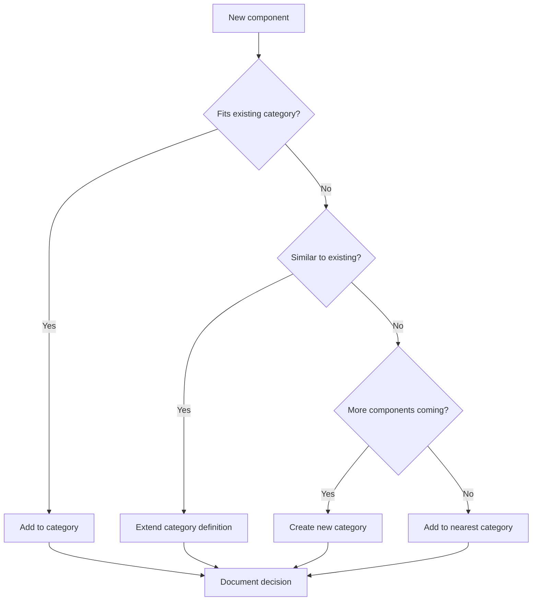

# 📘 Design System Component Functional Categorization Manual
*Version 1.0 | October 2025*

## Table of Contents
1. [Introduction](#introduction)
2. [Step-by-Step Categorization Process](#step-by-step-categorization-process)
3. [Main Category Definitions](#main-category-definitions)
4. [Decision Matrix](#decision-matrix)
5. [Edge Cases and Conflicts](#edge-cases-and-conflicts)
6. [Categorization Validation](#categorization-validation)
7. [Maintenance and Evolution](#maintenance-and-evolution)
8. [Checklists and Tools](#checklists-and-tools)

---

## Introduction

### Purpose
This manual enables consistent component categorization in any design system, regardless of size or industry. Based on analysis of 13 leading systems, with PatternFly (96 components) as the complexity benchmark.

### Target Audience
- **Junior Designers/Developers** - Clear steps and checklists
- **Senior Team Members** - Decision matrix, edge cases
- **Design System Teams** - Governance and evolution process
- **Product Managers** - Success metrics and ROI

### Guiding Principles
1. **User-first**: Categories reflect users' mental models
2. **Task-oriented**: Group by tasks, not structure
3. **Findability > Purity**: Easy to find > perfect taxonomy
4. **Single source of truth**: One component, one location
5. **Progressive disclosure**: Simple to complex

---

## Step-by-Step Categorization Process

### Phase 1: Inventory (Days 1-3)

#### Step 1.1: Gather All Components
```markdown
☐ List of all existing components
☐ Variants and states for each component
☐ Dependencies between components
☐ Usage frequency (from analytics)
☐ User feedback
```

#### Step 1.2: Create Component Card
For each component, complete:
```yaml
Component: [Name]
Primary_Function: [What it does]
User_Intent: [What user is looking for]
Common_Tasks: [Task list]
Related_Components: [Related items]
Current_Category: [If exists]
Usage_Frequency: [High/Medium/Low]
Complexity: [Simple/Moderate/Complex]
```

### Phase 2: Initial Categorization (Days 4-5)

#### Step 2.1: Apply Core Categories
Assign each component to one of 12 main categories (details in next section).

#### Step 2.2: Identify Conflicts
Flag components that:
- Fit multiple categories
- Don't fit any category
- Are used in different contexts

### Phase 3: Validation (Days 6-7)

#### Step 3.1: Card Sorting Test
With 5-10 users, conduct:
1. Open card sort (create their own categories)
2. Closed card sort (use your categories)
3. Tree testing (can they find components)

#### Step 3.2: Analysis and Correction
- Agreement >70% = category OK
- Agreement 40-70% = needs clarification
- Agreement <40% = reconsider category

### Phase 4: Documentation (Days 8-10)

#### Step 4.1: Create Documentation
- Definition of each category
- Component examples
- Edge cases
- Decision process

---

## Main Category Definitions

### 1. 🎬 Actions & Controls
**Definition**: Components that enable users to perform actions or control interface behavior.

**Characteristics**:
- Trigger state changes
- Have clear effects
- Often have states (hover, active, disabled)

**Typical Components**:
```
- Button (all variants)
- Link
- Menu item
- Toolbar action
- Command palette
- Keyboard shortcut indicator
```

**Qualification Test**:
> "Does clicking/interacting cause an action or change?"

---

### 2. 📝 Forms & Inputs
**Definition**: Components for collecting data from users.

**Characteristics**:
- Accept user input
- Have validation
- Return values

**Typical Components**:
```
- Text input/field
- Textarea
- Select/Dropdown
- Checkbox
- Radio button
- Toggle/Switch
- Slider
- Date picker
- Time picker
- File upload
- Color picker
- Rich text editor
- Search field
```

**Qualification Test**:
> "Does the component collect or modify user data?"

---

### 3. 🧭 Navigation & Wayfinding
**Definition**: Components that help users orient and move through the application.

**Characteristics**:
- Show location
- Enable movement
- Organize hierarchy

**Typical Components**:
```
- Navigation bar
- Sidebar
- Tabs
- Breadcrumbs
- Pagination
- Stepper/Progress steps
- Table of contents
- Jump links
- Back to top
```

**Qualification Test**:
> "Does it help users know where they are or where they can go?"

---

### 4. 📊 Data Display & Tables
**Definition**: Components for presenting organized data and information.

**Characteristics**:
- Display data
- Often sortable/filterable
- Can be interactive

**Typical Components**:
```
- Table/Data table
- List
- Tree view
- Timeline
- Calendar view
- Kanban board
- Gallery
- Data grid
- Comparison table
```

**Qualification Test**:
> "Is the main purpose to present organized data?"

---

### 5. 📦 Containers & Layout
**Definition**: Components that organize space and group content.

**Characteristics**:
- Define structure
- Group related elements
- No standalone functionality

**Typical Components**:
```
- Card
- Panel
- Accordion
- Collapsible
- Grid
- Stack
- Divider
- Section
- Layout templates
- Split view
```

**Qualification Test**:
> "Is the main role to organize other elements?"

---

### 6. 💬 Feedback & Messaging
**Definition**: Components that communicate system state and feedback.

**Characteristics**:
- Inform about state
- Confirm actions
- Warn about issues

**Typical Components**:
```
- Alert
- Toast/Snackbar
- Banner
- Notification
- Message
- Status indicator
- Empty state
- Error message
- Success message
```

**Qualification Test**:
> "Does it inform users about state or outcome?"

---

### 7. ⏳ Progress & Loading
**Definition**: Components showing operation progress or loading states.

**Characteristics**:
- Show time passage
- Inform about processes
- Reduce uncertainty

**Typical Components**:
```
- Progress bar
- Progress circle
- Spinner/Loading
- Skeleton screen
- Progress steps
- Loading overlay
- Busy indicator
```

**Qualification Test**:
> "Does it show something is happening or how much is left?"

---

### 8. 🎭 Overlays & Modals
**Definition**: Components that appear above main content.

**Characteristics**:
- Overlay content
- Require interaction
- Higher z-index

**Typical Components**:
```
- Modal/Dialog
- Drawer/Sheet
- Popover
- Tooltip
- Dropdown menu
- Context menu
- Lightbox
- Overlay
```

**Qualification Test**:
> "Does it appear above other elements?"

---

### 9. 🏷️ Badges & Labels
**Definition**: Components that add context or metadata.

**Characteristics**:
- Small, auxiliary
- Add information
- Often non-interactive

**Typical Components**:
```
- Badge
- Tag
- Chip
- Label
- Pill
- Count indicator
- Status badge
- Category tag
```

**Qualification Test**:
> "Does it add additional context to other elements?"

---

### 10. 🖼️ Media & Icons
**Definition**: Components for displaying visual content.

**Characteristics**:
- Present images
- Support communication
- Often decorative

**Typical Components**:
```
- Avatar
- Icon
- Image
- Video player
- Audio player
- Gallery
- Carousel
- Logo
- Thumbnail
```

**Qualification Test**:
> "Is the main purpose to display visual content?"

---

### 11. 🛠️ Utilities & Helpers
**Definition**: Components that support other components or functions.

**Characteristics**:
- Helper functions
- Often invisible
- Support a11y

**Typical Components**:
```
- Visually hidden
- Skip link
- Focus trap
- Portal
- Transition
- Resize observer
- Click outside
- Scroll lock
```

**Qualification Test**:
> "Does it support other components without its own UI?"

---

### 12. 🎨 Patterns & Composed
**Definition**: Complex UI patterns composed of multiple components.

**Characteristics**:
- Multi-component
- Solve specific problems
- Often configurable

**Typical Components**:
```
- Wizard
- Search with filters
- Date picker with range
- Login form
- Comment thread
- Product card
- User profile
- Dashboard widget
```

**Qualification Test**:
> "Is it a pattern composed of other components?"

---

## Decision Matrix

### For difficult cases, use this matrix:

| Question | Yes → | No → |
|----------|-------|------|
| Does it collect user data? | **Forms & Inputs** | Next question |
| Does it show progress/loading? | **Progress & Loading** | Next question |
| Does it appear above content? | **Overlays & Modals** | Next question |
| Does it help with navigation? | **Navigation** | Next question |
| Does it display data sets? | **Data Display** | Next question |
| Does it trigger an action? | **Actions & Controls** | Next question |
| Does it inform about state? | **Feedback & Messaging** | Next question |
| Does it organize layout? | **Containers & Layout** | Next question |
| Is it a small marker? | **Badges & Labels** | Next question |
| Is it media/image? | **Media & Icons** | Next question |
| Is it a helper function? | **Utilities** | Next question |
| Is it a complex pattern? | **Patterns** | **Actions & Controls** (default) |

---

## Edge Cases and Conflicts

### Case 1: Search Field
**Problem**: Is it Forms & Inputs or Navigation?

**Analysis**:
- Collects data ✓ (Forms)
- Helps find things ✓ (Navigation)

**Decision**: **Forms & Inputs**
**Why**: Primary function is data input. Navigation is a side effect.

**Alternative**: Create alias in Navigation pointing to Forms.

---

### Case 2: Tabs
**Problem**: Is it Navigation or Containers?

**Analysis**:
- Switches views ✓ (Navigation)
- Organizes content ✓ (Containers)

**Decision**: **Navigation**
**Why**: Users look for "how to switch between sections."

---

### Case 3: Card with Actions
**Problem**: Card with buttons - where to place?

**Analysis**:
- Container for content ✓
- Has actions ✓

**Decision**: **Containers & Layout**
**Why**: Card is the main component. Buttons are part of composition.

**Solution**: Document as "Card" in Containers, but mention action variant.

---

### Case 4: Date Picker
**Problem**: Simple input or complex pattern?

**Analysis**:
- Collects data ✓ (Input)
- Has calendar, navigation ✓ (Pattern)

**Decision**: **Forms & Inputs**
**Why**: From user perspective, it's a way to input a date.

---

### Case 5: Avatar
**Problem**: Media or Badge?

**Analysis**:
- Displays image ✓ (Media)
- Identifies user ✓ (Badge)

**Decision**: **Media & Icons**
**Why**: Primary function is displaying visual representation.

---

## Categorization Validation

### Success Metrics

#### Quantitative KPIs
```yaml
Search_Success_Rate: >85%  # Users find in <3 clicks
Category_Agreement: >70%   # Agreement in card sorting
Time_to_Find: <15s        # Average time to find
Miscategorization: <5%     # Components in wrong place
```

#### Qualitative Indicators
- New users don't ask "where is it?"
- Seniors don't complain about organization
- PR/Issue mentions about categorization decrease

### Testing Methods

#### A. Quick Validation (2h)
1. **5-second test**: Show structure, hide, ask what they remember
2. **First-click test**: Where would you click to find [component]?
3. **Expert review**: 2-3 seniors review categorization

#### B. Thorough Validation (2-3 days)
1. **Open card sort** (10 users)
2. **Closed card sort** (10 users)
3. **Tree testing** (20 tasks, 10 users)
4. **Analytics review** (search paths)

### Red Flags 🚩
- Category with 1-2 components
- Category with >20 components
- >30% of components could fit in 2+ categories
- Users create their own mental categories in card sort
- "Misc/Other" category exists

---

## Maintenance and Evolution

### Process for Adding New Component



### Quarterly Review

#### Q-Review Checklist
```markdown
☐ Analyze search queries (what can't they find?)
☐ Review new components (correctly categorized?)
☐ Feedback survey (categorization NPS)
☐ Compare with competition (new trends?)
☐ Refactor if >15% in wrong categories
```

### Category Migration

When you need to change categories:

1. **Communication** (30 days before)
   - Announce in Slack/Teams
   - Banner in documentation
   - Email to key users

2. **Redirects** (Day 0)
   - 301 for old URLs
   - Aliases in search
   - Breadcrumb helpers

3. **Deprecation** (90 days)
   - Old categories as "legacy"
   - Warnings in console
   - Dual listing period

4. **Cleanup** (Day 91)
   - Remove old categories
   - Update all links
   - Archive old structure

---

## Checklists and Tools

### Starter Checklist (For New Teams)

```markdown
## Before Starting
☐ We have a list of all components
☐ We know who our users are
☐ We have component usage data
☐ We've defined success metrics

## Categorization
☐ Each component has a card
☐ We've applied 12 categories
☐ We've identified edge cases
☐ We've conducted card sort

## Documentation
☐ Each category has a definition
☐ We have examples in each category
☐ Edge cases are documented
☐ Governance process exists

## Launch
☐ Team is trained
☐ Users are informed
☐ Monitoring is set up
☐ Feedback loop works
```

### Advanced Checklist (For Mature Systems)

```markdown
## Optimization
☐ A/B test different structures
☐ Personalization by role
☐ ML-based suggestions
☐ Cross-system alignment

## Automation
☐ Auto-categorization of new components
☐ Duplicate detection
☐ Usage-based reorganization
☐ Automated categorization testing

## Governance
☐ RACI matrix for decisions
☐ Escalation path for conflicts
☐ Version control for structure
☐ Change management process
```

### Helper Tools

#### Excel/Sheets Template
```
| Component | Primary Category | Secondary | Confidence | Notes |
|-----------|-----------------|-----------|------------|-------|
| Button    | Actions         | -         | High       |       |
| Card      | Containers      | Patterns  | Medium     | Has variants |
```

#### Miro/Figma Board Structure
```
[Category 1]
  ├─ [Component A]
  ├─ [Component B]
  └─ [Component C]

[Category 2]
  ├─ [Component D]
  └─ [Component E]

[Parking Lot]
  ├─ [Unclear 1]
  └─ [Unclear 2]
```

---

## Appendix A: Comparison with Other Methodologies

| Aspect | Functional (This manual) | Atomic Design | Platform-specific |
|--------|--------------------------|---------------|-------------------|
| **Learning curve** | Low | High | Medium |
| **Flexibility** | High | Low | Medium |
| **Scalability** | High | Medium | Low |
| **User-friendliness** | High | Low | High |
| **Maintenance** | Medium | High | High |
| **Cross-platform** | High | High | Low |

---

## Appendix B: Troubleshooting

### Problem: "Too many components in one category"
**Solution**:
1. Create subcategories
2. Consider splitting into 2 categories
3. Use tags for additional organization

### Problem: "Users disagree with categorization"
**Solution**:
1. Conduct more research
2. Change category names (not structure)
3. Add aliases and synonyms in search

### Problem: "Components fit multiple categories"
**Solution**:
1. Choose PRIMARY use case
2. Add cross-references
3. Use tags for secondary categories

---

## Appendix C: Glossary

**Card Sorting** - UX method where users group items

**Tree Testing** - Navigation test without visual design

**Information Architecture** - Information organization structure

**Mental Model** - How users think about the system

**Findability** - Ease of finding information

**Taxonomy** - Classification system

**Ontology** - Relationships between concepts

---

## Change History

| Version | Date | Changes | Author |
|---------|------|---------|--------|
| 1.0 | 2025-10-12 | Initial release | AI System Architect |

---

*This manual is a living document. Feedback and suggestions: design-system@company.com*