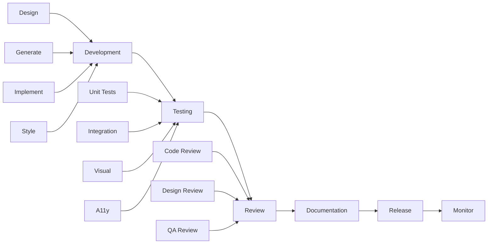

# 🚀 Component Development Pipeline

## End-to-End Workflow for Building Production-Ready Components

This document defines the complete pipeline for developing, testing, and deploying components in our design system. Every component must pass through all stages before reaching production.

---

## 📋 Table of Contents
1. [Pipeline Overview](#pipeline-overview)
2. [Development Stages](#development-stages)
3. [Quality Gates](#quality-gates)
4. [Automation Tools](#automation-tools)
5. [Testing Strategy](#testing-strategy)
6. [CI/CD Integration](#cicd-integration)
7. [Release Process](#release-process)
8. [Developer Workflow](#developer-workflow)

---

## 🔄 Pipeline Overview



### Pipeline Metrics
- **Average Time to Production**: 3-5 days per component
- **Quality Gate Pass Rate**: >95%
- **Automated Test Coverage**: >80%
- **Documentation Coverage**: 100%

---

## 🏗️ Development Stages

### Stage 1: Design & Planning (Day 1)

#### Requirements
- [ ] Design specifications in Figma
- [ ] Token requirements identified
- [ ] Accessibility requirements defined
- [ ] Component category determined
- [ ] User stories documented

#### Deliverables
```markdown
## Component: [Name]
- **Category**: [Functional category]
- **Priority**: P1/P2/P3
- **Variants**: primary, secondary, etc.
- **States**: default, hover, active, etc.
- **Sizes**: xs, sm, md, lg, xl
- **A11y**: WCAG 2.1 AA requirements
- **Dependencies**: Other components needed
```

### Stage 2: Generation & Setup (Day 1)

#### Using Component Generator
```bash
# Interactive generation for complex components
npm run generate

# Quick generation for simple components
npm run generate:quick -- ComponentName category
```

#### Generated Structure
```
components/[category]/[ComponentName]/
├── ComponentName.jsx         # Component implementation
├── ComponentName.stories.jsx # Storybook stories
├── ComponentName.test.js     # Unit tests
├── ComponentName.tokens.json # Design tokens
├── README.md                 # Documentation
└── index.js                  # Exports
```

### Stage 3: Implementation (Day 1-2)

#### Development Checklist
- [ ] **Core Functionality**
  ```jsx
  // Implement component logic
  export const Component = ({ variant, size, ...props }) => {
    // Business logic here
  };
  ```

- [ ] **Props & Types**
  ```jsx
  Component.propTypes = {
    variant: PropTypes.oneOf(['primary', 'secondary']),
    size: PropTypes.oneOf(['xs', 'sm', 'md', 'lg', 'xl']),
    disabled: PropTypes.bool,
    children: PropTypes.node.isRequired
  };
  ```

- [ ] **Token Integration**
  ```jsx
  const styles = {
    padding: `var(--${componentName}-size-${size}-padding)`,
    background: `var(--${componentName}-variant-${variant}-background)`
  };
  ```

- [ ] **Accessibility**
  ```jsx
  <button
    role="button"
    aria-label={ariaLabel}
    aria-disabled={disabled}
    tabIndex={disabled ? -1 : 0}
  />
  ```

### Stage 4: Testing (Day 2)

#### Test Requirements
```javascript
// Minimum test coverage requirements
const TEST_REQUIREMENTS = {
  unit: 80,        // 80% unit test coverage
  integration: 70, // 70% integration coverage
  visual: 100,     // All variants captured
  a11y: 100       // All a11y rules pass
};
```

### Stage 5: Documentation (Day 2-3)

#### Documentation Requirements
- [ ] Component README
- [ ] Storybook stories with all variants
- [ ] API documentation
- [ ] Usage examples
- [ ] Migration guide (if replacing existing)

### Stage 6: Review & Approval (Day 3)

#### Review Checklist
- [ ] Code review passed
- [ ] Design review passed
- [ ] QA testing passed
- [ ] Documentation complete
- [ ] Performance benchmarks met

---

## 🚦 Quality Gates

### Gate 1: Code Quality
```yaml
requirements:
  - ESLint: 0 errors, 0 warnings
  - Prettier: Formatted
  - Bundle Size: <5KB gzipped
  - Dependencies: Approved list only
  - Complexity: Cyclomatic <10
```

### Gate 2: Testing
```yaml
requirements:
  - Unit Tests: >80% coverage
  - Integration Tests: All passing
  - Visual Regression: No unexpected changes
  - A11y Tests: WCAG AA compliant
  - Cross-browser: Chrome, Firefox, Safari, Edge
```

### Gate 3: Performance
```yaml
requirements:
  - Render Time: <16ms
  - Re-render: Optimized with memo
  - Bundle Impact: <5KB increase
  - Memory Leaks: None detected
  - Animation: 60fps
```

### Gate 4: Documentation
```yaml
requirements:
  - README: Complete
  - Storybook: All stories present
  - Props: All documented
  - Examples: 3+ use cases
  - Tokens: Documented
```

---

## 🤖 Automation Tools

### 1. Pre-commit Hooks
```json
{
  "husky": {
    "hooks": {
      "pre-commit": "npm run lint && npm run test:unit",
      "pre-push": "npm run test:integration && npm run build"
    }
  }
}
```

### 2. Component Validation Script
```bash
#!/bin/bash
# scripts/validate-component.sh

COMPONENT=$1

echo "🔍 Validating $COMPONENT..."

# Check file structure
if [ ! -f "components/*/$COMPONENT/$COMPONENT.jsx" ]; then
  echo "❌ Component file missing"
  exit 1
fi

# Run tests
npm test -- $COMPONENT

# Check coverage
npm run test:coverage -- $COMPONENT

# Validate tokens
node scripts/validate-tokens.js $COMPONENT

# Check accessibility
npm run test:a11y -- $COMPONENT

echo "✅ Component validation passed!"
```

### 3. Automated Quality Checks
```javascript
// scripts/quality-check.js
const checks = [
  {
    name: 'Bundle Size',
    run: () => checkBundleSize(component),
    threshold: 5000 // 5KB
  },
  {
    name: 'Complexity',
    run: () => checkComplexity(component),
    threshold: 10
  },
  {
    name: 'Documentation',
    run: () => checkDocumentation(component),
    threshold: 100 // 100% required
  }
];
```

---

## 🧪 Testing Strategy

### Test Pyramid
```
         /\
        /  \  E2E Tests (10%)
       /    \
      /──────\  Integration Tests (30%)
     /        \
    /──────────\  Unit Tests (60%)
```

### 1. Unit Tests
```javascript
// ComponentName.test.js
describe('ComponentName', () => {
  it('renders with default props', () => {
    render(<Component />);
    expect(screen.getByRole('button')).toBeInTheDocument();
  });

  it('applies correct size classes', () => {
    const { container } = render(<Component size="lg" />);
    expect(container.firstChild).toHaveClass('component--lg');
  });

  it('handles click events', () => {
    const handleClick = jest.fn();
    render(<Component onClick={handleClick} />);
    fireEvent.click(screen.getByRole('button'));
    expect(handleClick).toHaveBeenCalledTimes(1);
  });
});
```

### 2. Integration Tests
```javascript
// ComponentName.integration.test.js
describe('ComponentName Integration', () => {
  it('works with form submission', async () => {
    render(
      <Form>
        <Component type="submit">Submit</Component>
      </Form>
    );
    
    fireEvent.click(screen.getByText('Submit'));
    await waitFor(() => {
      expect(screen.getByText('Success')).toBeInTheDocument();
    });
  });
});
```

### 3. Visual Regression Tests
```javascript
// ComponentName.visual.test.js
describe('Visual Regression', () => {
  variants.forEach(variant => {
    sizes.forEach(size => {
      it(`captures ${variant} ${size}`, async () => {
        const component = render(
          <Component variant={variant} size={size} />
        );
        await percySnapshot(`Component-${variant}-${size}`);
      });
    });
  });
});
```

### 4. Accessibility Tests
```javascript
// ComponentName.a11y.test.js
describe('Accessibility', () => {
  it('meets WCAG AA standards', async () => {
    const { container } = render(<Component />);
    const results = await axe(container);
    expect(results).toHaveNoViolations();
  });

  it('supports keyboard navigation', () => {
    render(<Component />);
    const element = screen.getByRole('button');
    element.focus();
    expect(element).toHaveFocus();
    
    fireEvent.keyDown(element, { key: 'Enter' });
    expect(handleClick).toHaveBeenCalled();
  });
});
```

---

## 🔄 CI/CD Integration

### GitHub Actions Workflow
```yaml
# .github/workflows/component-pipeline.yml
name: Component Pipeline

on:
  pull_request:
    paths:
      - 'components/**'
      - 'stories/**'

jobs:
  validate:
    runs-on: ubuntu-latest
    steps:
      - uses: actions/checkout@v3
      
      - name: Install Dependencies
        run: npm ci
      
      - name: Lint
        run: npm run lint
      
      - name: Type Check
        run: npm run type-check
      
      - name: Unit Tests
        run: npm run test:unit -- --coverage
      
      - name: Integration Tests
        run: npm run test:integration
      
      - name: Build Components
        run: npm run build:components
      
      - name: Check Bundle Size
        run: npm run size-limit
      
      - name: Visual Tests
        run: npm run test:visual
        env:
          PERCY_TOKEN: ${{ secrets.PERCY_TOKEN }}
      
      - name: A11y Tests
        run: npm run test:a11y
      
      - name: Upload Coverage
        uses: codecov/codecov-action@v3
        with:
          files: ./coverage/lcov.info
      
      - name: Build Storybook
        run: npm run build-storybook
      
      - name: Deploy Preview
        if: github.event_name == 'pull_request'
        run: npm run deploy:preview
```

### Branch Protection Rules
```yaml
protection_rules:
  main:
    required_reviews: 2
    dismiss_stale_reviews: true
    require_code_owner_reviews: true
    required_status_checks:
      - lint
      - test:unit
      - test:integration
      - test:a11y
      - build
    enforce_admins: true
    restrictions:
      users: ['lead-developer']
      teams: ['design-system-team']
```

---

## 📦 Release Process

### Semantic Versioning
```
MAJOR.MINOR.PATCH
1.0.0

MAJOR: Breaking changes
MINOR: New features
PATCH: Bug fixes
```

### Release Workflow
```bash
# 1. Create release branch
git checkout -b release/v1.2.0

# 2. Update version
npm version minor

# 3. Update changelog
npm run changelog

# 4. Build distribution
npm run build

# 5. Run final tests
npm test

# 6. Create PR
gh pr create --title "Release v1.2.0" --body "$(cat CHANGELOG.md)"

# 7. After approval, merge and tag
git checkout main
git merge release/v1.2.0
git tag v1.2.0
git push --tags

# 8. Publish to npm
npm publish

# 9. Deploy Storybook
npm run deploy:storybook
```

### Release Checklist
- [ ] All tests passing
- [ ] Documentation updated
- [ ] CHANGELOG.md updated
- [ ] Version bumped
- [ ] Migration guide (if breaking changes)
- [ ] Storybook deployed
- [ ] npm package published
- [ ] GitHub release created

---

## 👨‍💻 Developer Workflow

### Day 1: Setup & Implementation
```bash
# Morning: Setup
npm run generate                    # Generate component
cd components/[category]/[name]     # Navigate to component
code .                              # Open in editor

# Afternoon: Implementation
npm run dev                         # Start dev server
npm run storybook                   # View in Storybook
```

### Day 2: Testing & Documentation
```bash
# Morning: Testing
npm test ComponentName              # Run tests
npm run test:coverage ComponentName # Check coverage
npm run test:a11y ComponentName     # A11y testing

# Afternoon: Documentation
npm run docs:generate               # Generate API docs
npm run storybook                   # Update stories
```

### Day 3: Review & Ship
```bash
# Morning: Final checks
npm run validate ComponentName      # Run all validations
npm run build                       # Build component

# Afternoon: Ship
git add .
git commit -m "feat(component): add ComponentName"
git push origin feature/component-name
gh pr create                        # Create PR
```

### Quick Commands Reference
```bash
# Development
npm run generate                    # Generate new component
npm run dev                        # Start development server
npm run storybook                  # Start Storybook

# Testing
npm test [component]               # Run component tests
npm run test:watch                 # Watch mode
npm run test:coverage              # Coverage report
npm run test:a11y                  # Accessibility tests
npm run test:visual                # Visual regression tests

# Quality
npm run lint                       # Run ESLint
npm run lint:fix                   # Fix linting issues
npm run format                     # Format with Prettier
npm run type-check                 # TypeScript checking

# Build & Deploy
npm run build                      # Build components
npm run build:tokens               # Build design tokens
npm run build:storybook           # Build Storybook
npm run deploy:preview            # Deploy preview
npm run deploy:production         # Deploy to production

# Utilities
npm run validate [component]       # Validate single component
npm run size-limit                # Check bundle size
npm run changelog                 # Generate changelog
npm run docs:generate             # Generate documentation
```

---

## 📊 Pipeline Metrics & KPIs

### Quality Metrics
| Metric | Target | Current | Status |
|--------|--------|---------|--------|
| Test Coverage | >80% | 85% | ✅ |
| Bundle Size | <5KB | 3.2KB | ✅ |
| A11y Score | 100% | 100% | ✅ |
| Documentation | 100% | 95% | ⚠️ |
| Type Coverage | >95% | 98% | ✅ |

### Performance Metrics
| Metric | Target | Current | Status |
|--------|--------|---------|--------|
| Build Time | <2min | 1.5min | ✅ |
| Test Time | <5min | 3min | ✅ |
| Deploy Time | <10min | 7min | ✅ |
| Time to Production | <5 days | 3 days | ✅ |

### Developer Experience
| Metric | Target | Current | Status |
|--------|--------|---------|--------|
| Setup Time | <5min | 3min | ✅ |
| Hot Reload | <1s | 0.5s | ✅ |
| Generate Component | <30s | 10s | ✅ |
| Developer Satisfaction | >4.5/5 | 4.7/5 | ✅ |

---

## 🚨 Troubleshooting

### Common Issues

#### Component Not Building
```bash
# Clear cache and rebuild
rm -rf node_modules/.cache
npm run build:components
```

#### Tests Failing
```bash
# Run tests in debug mode
npm test -- --debug
npm test -- --verbose
```

#### Storybook Not Loading
```bash
# Rebuild Storybook
rm -rf storybook-static
npm run build-storybook
npm run storybook
```

#### Token References Not Working
```bash
# Rebuild tokens
npm run build:tokens
npm run validate:tokens
```

---

## 📚 Resources

### Documentation
- [Component Generator Guide](./GENERATOR_GUIDE.md)
- [Token Naming Convention](./TOKEN_NAMING_CONVENTION.md)
- [Testing Strategy](./TESTING_STRATEGY.md)
- [Release Guidelines](./RELEASE_GUIDELINES.md)

### Tools
- [Storybook](https://storybook.js.org/)
- [Jest](https://jestjs.io/)
- [Testing Library](https://testing-library.com/)
- [Percy](https://percy.io/)
- [GitHub Actions](https://github.com/features/actions)

### Templates
- [Component Template](../scripts/templates/component.jsx.hbs)
- [Story Template](../scripts/templates/component.stories.jsx.hbs)
- [Test Template](../scripts/templates/component.test.js.hbs)

---

## 🎯 Success Criteria

A component is considered "production-ready" when:

1. ✅ **Functionality**: All features working as designed
2. ✅ **Quality**: Passes all quality gates
3. ✅ **Testing**: >80% test coverage
4. ✅ **Accessibility**: WCAG 2.1 AA compliant
5. ✅ **Performance**: Meets performance benchmarks
6. ✅ **Documentation**: Fully documented
7. ✅ **Review**: Approved by design & dev teams
8. ✅ **Integration**: Works with existing components

---

*Pipeline Documentation v1.0 | October 2025*
*Last Updated: Today*