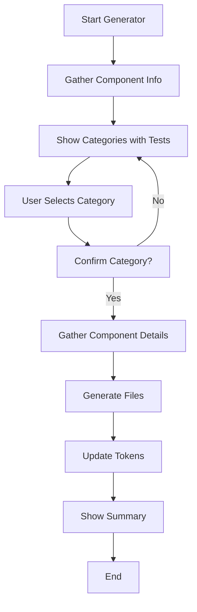

# 🎨 Component Generator Documentation

## Table of Contents
1. [Overview](#overview)
2. [Installation & Setup](#installation--setup)
3. [Generator Types](#generator-types)
4. [Interactive Generator](#interactive-generator)
5. [Quick Generator](#quick-generator)
6. [Generated Files Structure](#generated-files-structure)
7. [Category System](#category-system)
8. [Customization](#customization)
9. [Best Practices](#best-practices)
10. [Troubleshooting](#troubleshooting)
11. [Architecture](#architecture)

---

## Overview

The Component Generator is an automated tool for creating consistent, well-structured components in our functional design system. It ensures every component follows the same patterns, includes proper documentation, and maintains consistency across the codebase.

### Key Features
- 🎯 **Functional categorization** - Components organized by purpose
- 📝 **Complete file generation** - All necessary files created automatically
- 🧪 **Test-ready** - Includes test files and Storybook stories
- 🎨 **Token integration** - Automatic design token generation
- ♿ **Accessibility-first** - Built-in a11y considerations
- 📚 **Self-documenting** - Generates comprehensive README files

---

## Installation & Setup

### Prerequisites
```bash
# Required dependencies (already installed)
npm install inquirer chalk ora handlebars
```

### Available Scripts
```json
{
  "scripts": {
    "generate": "node scripts/generate-component.js",
    "generate:component": "node scripts/generate-component.js",
    "generate:quick": "node scripts/quick-generate.js"
  }
}
```

---

## Generator Types

### 1. Interactive Generator
Full-featured generator with guided prompts and intelligent categorization.

```bash
npm run generate
```

### 2. Quick Generator
Rapid component creation with minimal configuration.

```bash
npm run generate:quick -- ComponentName category
```

---

## Interactive Generator

### How It Works

#### Step 1: Component Information
```
? Component name (PascalCase): Button
? Component description: Primary action trigger
? What is the main purpose of this component? Trigger user actions
```

#### Step 2: Category Determination
The generator shows all 12 categories with qualification tests:

```
? Which category best fits your component?
❯ Actions & Controls
    Does clicking/interacting cause an action or change?
    Examples: Button, Link, Menu Item
  
  Forms & Inputs
    Does the component collect or modify user data?
    Examples: Input, Select, Checkbox
  
  [... more categories ...]
```

#### Step 3: Component Details
```
? Select supported sizes: (Press <space> to select)
❯◉ xs
 ◉ sm
 ◉ md
 ◉ lg
 ◉ xl

? Select supported states:
❯◉ default
 ◉ hover
 ◉ focus
 ◉ disabled
 ◯ loading
 ◯ error
 ◯ success

? Enter variants (comma-separated): primary, secondary, danger
? Does this component support icons? Yes
? Include accessibility features? Yes
? Generate test files? Yes
```

### Interactive Generator Flow Diagram


---

## Quick Generator

### Usage
```bash
npm run generate:quick -- ComponentName category
```

### Examples
```bash
# Create a Button in Actions & Controls
npm run generate:quick -- Button actions

# Create a Card in Containers & Layout
npm run generate:quick -- Card containers

# Create an Alert in Feedback & Messaging
npm run generate:quick -- Alert feedback
```

### Category Shortcuts
| Shortcut | Full Category | Description |
|----------|--------------|-------------|
| `actions` | 01-actions-controls | Action triggers |
| `forms` | 02-forms-inputs | Data collection |
| `navigation` | 03-navigation-wayfinding | Navigation aids |
| `data` | 04-data-display-tables | Data presentation |
| `containers` | 05-containers-layout | Layout organization |
| `feedback` | 06-feedback-messaging | System feedback |
| `progress` | 07-progress-loading | Loading states |
| `overlays` | 08-overlays-modals | Overlay content |
| `badges` | 09-badges-labels | Metadata |
| `media` | 10-media-icons | Visual content |
| `utilities` | 11-utilities-helpers | Helper components |
| `patterns` | 12-patterns-composed | Complex patterns |

---

## Generated Files Structure

### File Tree
```
components/
└── [category]/
    └── [ComponentName]/
        ├── ComponentName.jsx         # Main component
        ├── ComponentName.stories.jsx # Storybook stories
        ├── ComponentName.test.js     # Unit tests
        ├── ComponentName.tokens.json # Design tokens
        ├── README.md                 # Documentation
        └── index.js                  # Exports
```

### File Descriptions

#### 1. ComponentName.jsx
Main component implementation with:
- Props validation with PropTypes
- Functional component structure
- CSS class management
- Accessibility attributes

```jsx
export const Button = ({
  children,
  variant = 'primary',
  size = 'md',
  disabled = false,
  className = '',
  ...props
}) => {
  const classes = [
    'button',
    `button--${variant}`,
    `button--${size}`,
    disabled && 'button--disabled',
    className
  ].filter(Boolean).join(' ');

  return (
    <button className={classes} disabled={disabled} {...props}>
      {children}
    </button>
  );
};
```

#### 2. ComponentName.stories.jsx
Storybook stories with:
- Default story configuration
- Variant examples
- Size variations
- State demonstrations
- Interactive controls

```jsx
export default {
  title: 'Actions & Controls/Button',
  component: Button,
  parameters: {
    category: '01-actions-controls',
  },
  argTypes: {
    variant: {
      control: { type: 'select' },
      options: ['primary', 'secondary', 'danger']
    }
  }
};
```

#### 3. ComponentName.test.js
Test suite including:
- Render tests
- Props validation
- State changes
- Accessibility checks

```jsx
describe('Button', () => {
  it('renders children correctly', () => {
    render(<Button>Click me</Button>);
    expect(screen.getByText('Click me')).toBeInTheDocument();
  });
  
  it('applies variant class', () => {
    const { container } = render(<Button variant="primary">Test</Button>);
    expect(container.firstChild).toHaveClass('button--primary');
  });
});
```

#### 4. ComponentName.tokens.json
Design tokens for:
- Size variations
- Visual variants
- State styles
- Spacing and typography

```json
{
  "button": {
    "size": {
      "sm": {
        "padding": { "value": "{spacing.2}", "type": "dimension" },
        "fontSize": { "value": "{fontSize.sm}", "type": "dimension" }
      }
    },
    "variant": {
      "primary": {
        "background": { "value": "{brand.primary}", "type": "color" },
        "color": { "value": "{color.white}", "type": "color" }
      }
    }
  }
}
```

#### 5. README.md
Documentation including:
- Component description
- Usage examples
- Props table
- Accessibility notes
- Token references

#### 6. index.js
Export configuration:
```js
export { Button } from './Button';
export { default } from './Button';
```

---

## Category System

### Qualification Tests
Each category has a qualification test to help determine correct placement:

| Category | Qualification Test | Examples |
|----------|-------------------|----------|
| **Actions & Controls** | Does clicking/interacting cause an action or change? | Button, Link, Menu |
| **Forms & Inputs** | Does the component collect or modify user data? | Input, Select, Checkbox |
| **Navigation** | Does it help users know where they are or where they can go? | Tabs, Breadcrumb |
| **Data Display** | Is the main purpose to present organized data? | Table, List, Tree |
| **Containers** | Is the main role to organize other elements? | Card, Grid, Panel |
| **Feedback** | Does it inform users about state or outcome? | Alert, Toast, Banner |
| **Progress** | Does it show something is happening or how much is left? | Spinner, Progress Bar |
| **Overlays** | Does it appear above other elements? | Modal, Tooltip, Popover |
| **Badges** | Does it add additional context to other elements? | Badge, Tag, Chip |
| **Media** | Is the main purpose to display visual content? | Avatar, Icon, Image |
| **Utilities** | Does it support other components without its own UI? | Focus Trap, Portal |
| **Patterns** | Is it a pattern composed of other components? | Wizard, Search |

---

## Customization

### Modifying Templates

Templates use Handlebars syntax and can be customized in the generator:

```javascript
// In generate-component.js
function getDefaultTemplate(templateName) {
  const templates = {
    'component.jsx.hbs': `
      // Your custom template here
      export const {{name}} = ({ {{#each props}}{{this}}, {{/each}} }) => {
        // Component logic
      };
    `
  };
}
```

### Adding Custom Prompts

Extend the generator with additional questions:

```javascript
async function promptComponentDetails(componentInfo, category) {
  const answers = await inquirer.prompt([
    // Add custom questions
    {
      type: 'confirm',
      name: 'hasAnimation',
      message: 'Include animation support?',
      default: false
    },
    {
      type: 'input',
      name: 'customProp',
      message: 'Any custom props to add?'
    }
  ]);
}
```

### Token Configuration

Modify how tokens are generated:

```javascript
async function updateComponentTokens(componentInfo, category, details) {
  const tokens = {
    [componentKey]: {
      // Custom token structure
      animation: {
        duration: { value: '200ms', type: 'duration' }
      }
    }
  };
}
```

---

## Best Practices

### 1. Naming Conventions
- **Component names**: PascalCase (e.g., `ButtonGroup`)
- **File names**: Match component name
- **CSS classes**: kebab-case (e.g., `button-group`)
- **Props**: camelCase (e.g., `isDisabled`)

### 2. Component Organization
```
✅ DO:
- One component per folder
- Keep related styles together
- Include all necessary files

❌ DON'T:
- Mix multiple components
- Scatter related files
- Skip documentation
```

### 3. Token Usage
Always reference design tokens instead of hardcoded values:
```css
/* ✅ Good */
.button {
  padding: var(--spacing-md);
  color: var(--color-primary);
}

/* ❌ Bad */
.button {
  padding: 16px;
  color: #0066cc;
}
```

### 4. Accessibility Checklist
Every generated component should:
- ✅ Have proper ARIA attributes
- ✅ Support keyboard navigation
- ✅ Include focus states
- ✅ Provide screen reader text
- ✅ Meet color contrast requirements

---

## Troubleshooting

### Common Issues

#### Issue: Generator fails with "chalk is not a function"
**Solution**: The chalk import needs to be handled differently in newer versions
```javascript
const chalk = require('chalk').default || require('chalk');
```

#### Issue: Component not appearing in Storybook
**Solution**: Ensure Storybook config includes new path
```javascript
// .storybook/main.js
stories: [
  '../components/**/*.stories.@(js|jsx|ts|tsx)',
]
```

#### Issue: Tokens not being applied
**Solution**: Check token reference syntax
```javascript
// Correct reference
{ value: "{spacing.md}", type: "dimension" }
```

#### Issue: Tests failing
**Solution**: Ensure testing library is properly configured
```bash
npm install --save-dev @testing-library/react @testing-library/user-event
```

### Debug Mode

Enable verbose output for troubleshooting:
```bash
DEBUG=true npm run generate
```

---

## Architecture

### Generator Flow

```
┌─────────────────┐
│   User Input    │
└────────┬────────┘
         │
         v
┌─────────────────┐
│ Validate Input  │
└────────┬────────┘
         │
         v
┌─────────────────┐
│Determine Category│
└────────┬────────┘
         │
         v
┌─────────────────┐
│ Gather Details  │
└────────┬────────┘
         │
         v
┌─────────────────┐
│ Load Templates  │
└────────┬────────┘
         │
         v
┌─────────────────┐
│ Generate Files  │
└────────┬────────┘
         │
         v
┌─────────────────┐
│  Update Tokens  │
└────────┬────────┘
         │
         v
┌─────────────────┐
│  Show Summary   │
└─────────────────┘
```

### File Dependencies

```
generate-component.js
├── inquirer (prompts)
├── chalk (styling)
├── ora (spinner)
├── handlebars (templates)
└── fs/path (file system)

quick-generate.js
└── fs/path (file system)
```

### Template Processing

1. **Input Collection**: Gather component details
2. **Data Preparation**: Prepare template variables
3. **Template Compilation**: Process Handlebars templates
4. **File Generation**: Write files to disk
5. **Token Update**: Merge with existing tokens

---

## Examples

### Example 1: Creating a Navigation Component

```bash
$ npm run generate

? Component name (PascalCase): NavigationMenu
? Component description: Main navigation menu component
? What is the main purpose of this component? Help users navigate the application

? Which category best fits your component?
❯ Navigation & Wayfinding
    Does it help users know where they are or where they can go?
    Examples: Tabs, Breadcrumb, Menu

? Confirm: "NavigationMenu" belongs in "Navigation & Wayfinding"? Yes

? Select supported sizes: sm, md, lg
? Select supported states: default, hover, active, focus
? Enter variants: horizontal, vertical, mobile
? Does this component support icons? Yes
? Include accessibility features? Yes
? Generate test files? Yes

✨ Component Generated Successfully!
📁 Location: components/03-navigation-wayfinding/NavigationMenu/
```

### Example 2: Quick Generation of Form Component

```bash
$ npm run generate:quick -- TextArea forms

✅ TextArea component generated successfully!
📁 Location: components/02-forms-inputs/TextArea/

Generated files:
  - TextArea.jsx
  - TextArea.stories.jsx
  - TextArea.test.js
  - TextArea.tokens.json
  - README.md
  - index.js
```

### Example 3: Creating a Complex Pattern

```bash
$ npm run generate:quick -- SearchWithFilters patterns

✅ SearchWithFilters component generated successfully!
📁 Location: components/12-patterns-composed/SearchWithFilters/
```

---

## Maintenance

### Adding New Categories

1. Update `CATEGORIES` object in `generate-component.js`:
```javascript
const CATEGORIES = {
  '13-new-category': {
    name: 'New Category',
    test: 'Does it do something new?',
    examples: ['Example1', 'Example2'],
    tokens: ['size', 'variant']
  }
};
```

2. Create category folder:
```bash
mkdir -p components/13-new-category
```

3. Add category README:
```bash
echo "# New Category" > components/13-new-category/README.md
```

### Updating Templates

Templates can be updated without modifying the generator:

1. Create template files in `scripts/templates/`
2. Use Handlebars syntax for dynamic content
3. Generator will automatically use file templates if they exist

### Version Control

Generated components should be committed with meaningful messages:

```bash
git add components/[category]/[ComponentName]
git commit -m "feat(components): add ComponentName to category

- Generated with component generator
- Includes tests and documentation
- Tokens integrated"
```

---

## Future Enhancements

### Planned Features
- [ ] TypeScript template support
- [ ] CSS-in-JS option
- [ ] Component composition analyzer
- [ ] Automatic dependency detection
- [ ] Design token validation
- [ ] Visual regression test generation
- [ ] Figma integration
- [ ] Component metrics tracking

### Community Contributions
We welcome contributions to improve the generator:

1. Fork the repository
2. Create a feature branch
3. Add your enhancement
4. Submit a pull request

---

## Support

### Resources
- [Design System Documentation](../README.md)
- [Component Guidelines](./COMPONENT_GUIDELINES.md)
- [Token Documentation](./TOKENS.md)
- [Storybook Guide](./STORYBOOK.md)

### Getting Help
- **Issues**: File on GitHub
- **Questions**: Post in #design-system Slack channel
- **Updates**: Check CHANGELOG.md

---

*Last Updated: October 2025*
*Version: 1.0.0*